# OBD Gauge Cluster

[](https://github.com/cheeseprince/obd-gauge-cluster/actions/workflows/ci.yml)
[](https://scorecard.dev/viewer/?uri=github.com/cheeseprince/obd-gauge-cluster)
[](https://www.bestpractices.dev/projects/13834)
[&replace=%241&label=OTA&color=blue)](https://cheeseprince.github.io/obd-gauge-cluster/manifest.txt)
[](https://www.printables.com/model/1788789-obd-gauge-cluster-case)
[](LICENSE)
[](#ai-assistance)

An in-cab gauge display that shows what your factory dash doesn't. It reads standard OBD-II
on any vehicle, and where a profile exists it also reads the **manufacturer-specific**
parameters — transmission temperature, oil pressure, EGT, DPF pressure, fuel rail pressure,
DEF level — over a cheap Bluetooth adapter on a small dashboard screen.

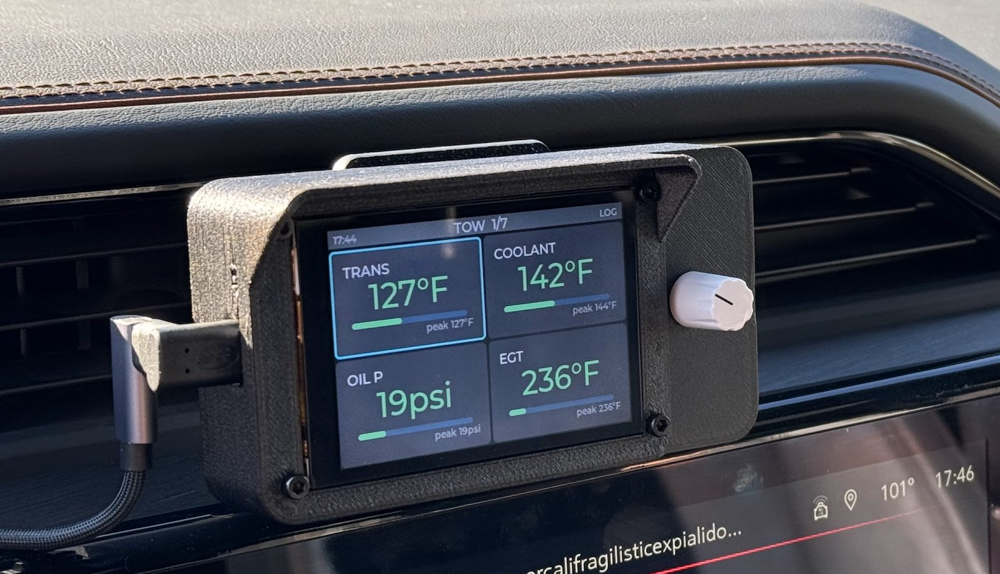

One firmware image holds **every vehicle profile** and picks the right one automatically from the
car's **VIN** on connect (with a **Pick Vehicle** menu override). It's **validated on a 2025 GM
Sierra 1500 3.0L Duramax** (LZ0, Global B); a BMW 535i (F10), an Audi Q5 (2.0T) and a Jeep
Wagoneer (5.7L Hemi) are skeleton profiles, and a Ford 6.7L Power Stroke is researched (see
[Vehicles it works on](#vehicles-it-works-on)).
The enhanced parameters above are not standardized and no manufacturer publishes them, so adding
a vehicle means discovering its PID map on the vehicle itself — the tooling for that is included
(`tools/obd_scan`).

## AI assistance

This project was built with substantial help from an AI coding assistant (Anthropic's Claude)
— firmware, the scanner tooling, tests, and documentation. Every change is reviewed and gated
by CI (host + fuzz tests, device builds, secret/PII scans), and each vehicle profile is
validated against a real vehicle before it is trusted. Nothing here is auto-generated and left
unchecked.

## What it does

Tiles grouped by task, one page at a time. One rotary knob drives everything: turn to move,
press to zoom a tile, hold for settings. Out-of-range values turn amber, then red.

**Every screenshot below is the GMC Sierra Duramax profile — 7 pages, 27 tiles.** Other
vehicles ship fewer and different pages; see [Vehicles it works on](#vehicles-it-works-on).

| TOWING | POWER |
| :---: | :---: |
| 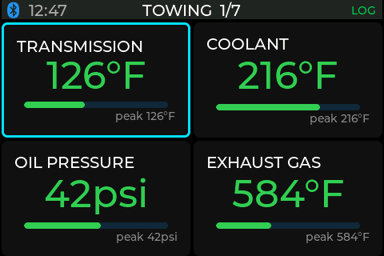 | 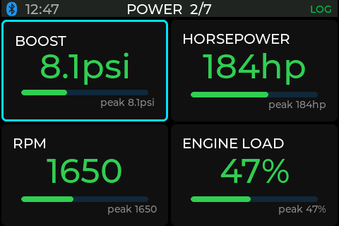 |
| Transmission · coolant · oil pressure · exhaust gas | Boost · horsepower · RPM · engine load |

| REGENERATION | RANGE |
| :---: | :---: |
| 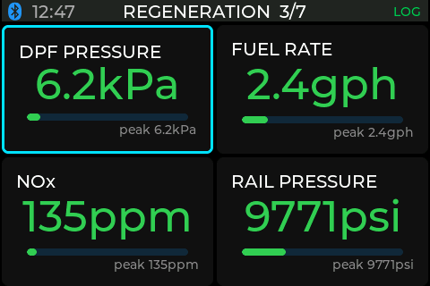 | 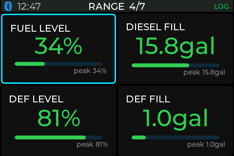 |
| DPF pressure · fuel rate · NOx · rail pressure | Fuel and DEF level + gallons-to-fill |

| TRIP | DIAGNOSTICS | MISCELLANEOUS |
| :---: | :---: | :---: |
| 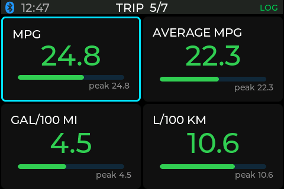 | 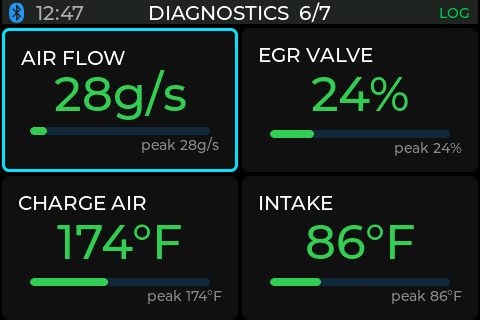 | 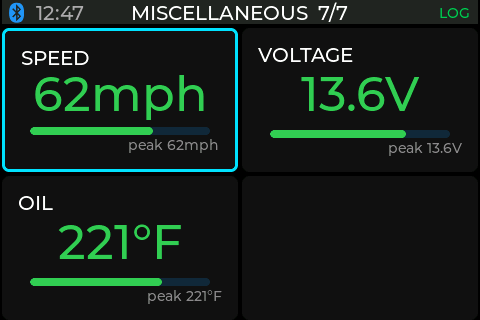 |
| Instant + average economy | Air flow · EGR valve · charge air · intake | Speed · voltage · oil temp |

Press the knob to zoom one tile, with a rolling trend graph coloured by alarm zone — a
**5-minute** window. The theme follows
sunrise and sunset from the on-board clock; units switch imperial/metric.

| Focus view | Night theme | Metric |
| :---: | :---: | :---: |
| 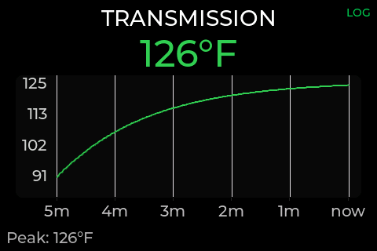 | 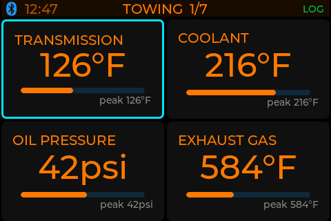 | 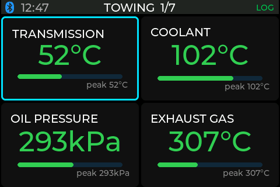 |

Every reading is checked against per-stat thresholds set in the vehicle profile: amber on a
warn crossing, red on a critical one, with the trend line coloured per sample.

| Warning tile | Error tile | Trend graph, all three zones |
| :---: | :---: | :---: |
| 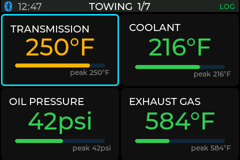 | 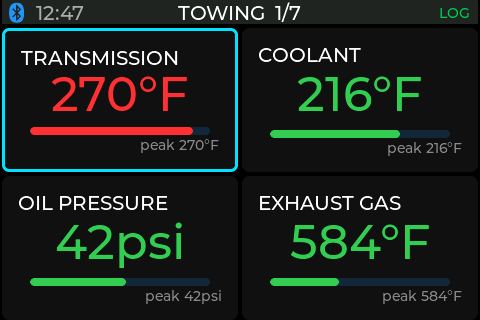 | 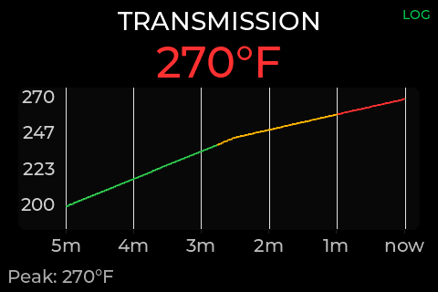 |
| TRANSMISSION in the amber warn band | TRANSMISSION over the red critical line | Green → amber → red across the window |

The status bar shows link and logging state at a glance: Bluetooth icon, clock, page, and the
SD-logging indicator.

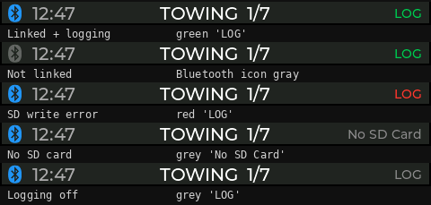

Everything logs to a microSD card at 1 Hz. **Full detail** — every tile, the alarm model, the
status-bar states: [`docs/DISPLAY.md`](docs/DISPLAY.md). **The layout is editable** (one table
in the vehicle profile): [`docs/CUSTOMIZING-VIEWS.md`](docs/CUSTOMIZING-VIEWS.md).

## Vehicles it works on

All profiles ship in one image; the firmware **auto-selects by VIN** on connect. An unrecognized
VIN falls back to a generic Mode-01 profile, and **Settings → Pick Vehicle** overrides and locks
the choice.

| Manufacturer | Model | Engine | Years | Pages | Status |
| :--- | :--- | :--- | :--- | :--- | :--- |
| Audi | Q5 (typ FY) | 2.0T TFSI EA888.3 | 2018–20 | **3** — TEMPERATURES · DRIVE · AIR | 🟡 Skeleton — [details](docs/VEHICLES.md#audi) |
| BMW | 535i (F10) | N55 3.0L turbo I6 | 2011–16 | **3** — ENGINE · DRIVE · MISCELLANEOUS | 🟡 Skeleton — [details](docs/VEHICLES.md#bmw) |
| Chevrolet | Silverado 1500 | 3.0L Duramax LZ0 | 2023–26 | 7 — same profile as the Sierra | ✅ Expected, not separately tested |
| Ford | F-250/350 Super Duty | 6.7L Power Stroke | 2017–22 | — none yet | 🔬 Researched, needs a scan |
| GMC | Sierra 1500 | 3.0L Duramax LZ0 | 2023–26 | **7** — TOWING · POWER · REGENERATION · RANGE · TRIP · DIAGNOSTICS · MISCELLANEOUS | ✅ **Validated on a real truck** |
| Jeep | Wagoneer (WS) | 5.7L Hemi eTorque | 2022–24 | **4** — TEMPERATURES · DRIVE · POWER · MISCELLANEOUS | 🟡 Skeleton — [details](docs/VEHICLES.md#jeep) |
| *(any other)* | — | — | — | **2** — ENGINE · AIR | ⚪ **Generic** — standard OBD-II only |

Gas cars have no DPF, DEF, EGT or regeneration, so the truck pages don't exist for them — a BMW
or Audi gets three pages of what its engine actually reports.

Enhanced (Mode 22 / UDS) PIDs are manufacturer-specific and undocumented, so adding a vehicle
means discovering its PID map on the actual vehicle. Standard OBD-II parameters (RPM, speed,
coolant, load) work anywhere; the enhanced ones only where a profile exists. **Per-vehicle
detail and how VIN selection works:** [`docs/VEHICLES.md`](docs/VEHICLES.md).

## Hardware you need

| Part | Detail |
| :--- | :--- |
| Display / MCU | [Elecrow CrowPanel Advance 3.5"](https://www.elecrow.com/crowpanel-advance-3-5-hmi-esp32-ai-display-480x320-artificial-intelligent-ips-touch-screen.html) (ESP32-S3-WROOM-1-N16R8), 480×320 IPS |
| Input | [Arduino Modulino Knob](https://store-usa.arduino.cc/products/modulino-knob) rotary encoder (I²C) |
| Encoder cable | [SparkFun Qwiic-to-Grove cable](https://www.sparkfun.com/qwiic-cable-grove-adapter-100mm.html) (the board is Grove, the encoder is Qwiic) |
| Storage | A microSD card (FAT32) for logging — the slot is on-board |
| OBD adapter | A **BLE** ELM327 — see [Adapters](docs/ADAPTERS.md) |
| Power | Truck USB (switched 5 V) → board USB-C |

**Assembly is one cable.** The panel has a **Grove** I²C plug and the knob has a **Qwiic** plug,
so the SparkFun adapter cable bridges them. Everything else is on-board or plug-in. Full guide:
[`docs/WIRING.md`](docs/WIRING.md).


**Case** — three printed parts plus **8× M3 heat-set inserts** (4 mm long, 5 mm OD) and
**4× M3×10 + 4× M3×6 screws**. STLs, print settings and photos:

**→ https://www.printables.com/model/1788789-obd-gauge-cluster-case**

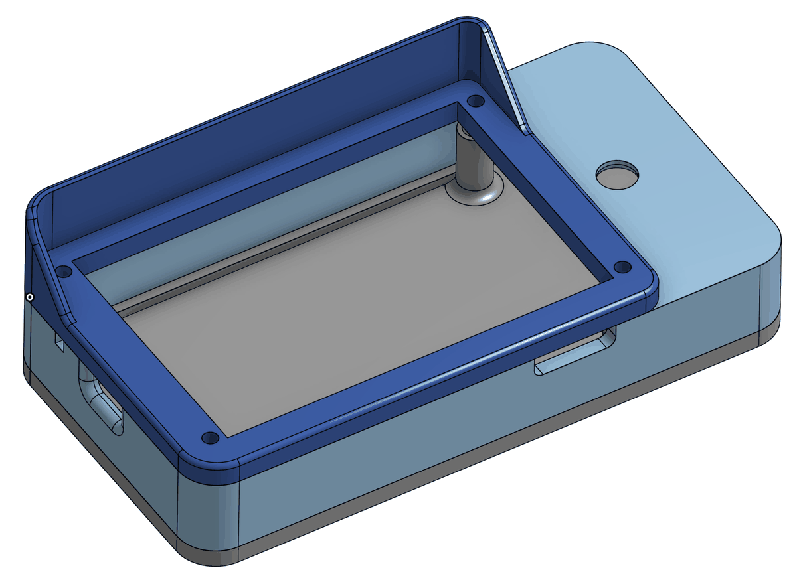

BOM and dimensions: [`hardware/`](hardware/). **Why this board and this input method**, and what
was tried first: [`docs/HARDWARE.md`](docs/HARDWARE.md).

This is the only supported board. An earlier Elecrow WROVER-B was retired — see
[`docs/HARDWARE.md`](docs/HARDWARE.md) for what it was and why the CrowPanel replaced it.

## Install it

**Prerequisites:** PlatformIO Core, Python 3.12, and git. Verified on macOS and Linux; Windows
is untested. The first install is over USB; everything after that is done from your phone and
the knob.

**1. Flash the firmware (once, over USB).** Connect the CrowPanel with a **data** USB-C cable
and, from a clone of this repo:

```
pio run -e crowpanel_obd -t upload
```

Wrong port? Find it with `ls /dev/cu.usbmodem*` (macOS) or `ls /dev/ttyACM*` (Linux) and pass
it with `--upload-port`.

**2. Power it in the vehicle.** Plug into a switched USB port. The dash boots to a connecting
screen.

**3. Provision WiFi and location (from your phone).** Long-press the knob → **WiFi setup**. The
dash raises a per-device network **`OBD-XXXX`** with a random password shown on screen; join it
and a setup page opens at `http://192.168.4.1`. Add your WiFi (needed for updates) and your
location (enables automatic day/night). Tap **Done** and the dash reboots.

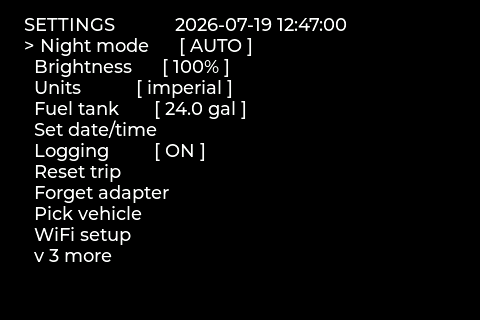

**4. Plug in the OBD adapter.** Get a **BLE / "Bluetooth 4.0"** ELM327 — the dash scans and
auto-connects, no pairing step.

| Adapter | Transport | Build | Status |
| :--- | :--- | :--- | :--- |
| Vgate **vLinker MS** | BLE | `crowpanel_obd` | ✅ **Validated** — ⚠️ ships in Classic/MFi mode; see below |
| Vgate **iCar Pro BLE 4.0** | BLE | `crowpanel_obd` | ✅ **Validated** — and works out of the box |
| Generic CC2541 / `0xFFE0` / `0xFFF0` clones | BLE | `crowpanel_obd` | 🟡 Should work — not bench-tested |
| Any PIN-pairing classic-BT ELM327 | Classic BT | — | ❌ **Unsupported** — the dash is BLE-only |
| **OBDLink MX+ / CX** | BLE (proprietary) | — | ❌ **Unsupported** |

> ⚠️ **The vLinker MS does not work out of the box.** It ships in a Classic/MFi-only
> mode and will not advertise over BLE until you switch it to **BT+BLE** once, using
> Vgate's own updater app on a phone. Do this before you go looking for faults in the
> dash — a stock adapter simply never appears in the scan.
>
> **The iCar Pro BLE 4.0 needs no such step** — validated on the dash, plugged in and
> linked with nothing to configure. If you are buying an adapter now, that makes it the
> easier of the two.

Why each verdict, the GATT profiles supported, and how to report a working adapter:
[`docs/ADAPTERS.md`](docs/ADAPTERS.md). To switch adapters later, use **Forget adapter** in the
settings menu.

**5. Set the clock** (optional) via **Set date/time** — it backs up to the coin cell, so you
only do it once.

Gauges appear once the adapter links. From here, updates are over-the-air — no cable.
**Full walkthrough, per-OS notes and troubleshooting:** [`docs/INSTALL.md`](docs/INSTALL.md).

## Updates

The dash updates itself over WiFi — **Settings → Check update**. It fetches the published
manifest, refuses anything not signed by this project's key, verifies a SHA-256 of the image,
and flashes into a spare slot. Failure at any step leaves the running firmware untouched. No
cable.

Cutting a release (maintainers): push a version tag.

```
git tag vX.Y.Z && git push origin vX.Y.Z
```

Releases publish **one image, `crowpanel_obd.bin`** — not one per vehicle, since all profiles
ship together and are selected at runtime by VIN. Signing, the release pipeline,
anti-rollback and hosting updates
for a fork: [`docs/OTA.md`](docs/OTA.md).

## Port your vehicle

The firmware, transport, UI, logging and OTA are vehicle-agnostic; the only per-vehicle part is
a profile in [`src/vehicles/`](src/vehicles/) (PID table, decoders, thresholds, layout, tank
sizes). Mapping a new vehicle needs one thing this project cannot supply remotely: **the
vehicle**.

`tools/obd_scan/` maps an unknown vehicle's enhanced PIDs from a laptop. It is **read-only by
construction** — only OBD read services and an allow-listed set of AT commands can be
transmitted; writes, routines, resets and clears are rejected in code, because it runs on
vehicles that may not be yours.

```
cd tools
python3 -m obd_scan census    --vehicle gm -o census.json
python3 -m obd_scan sweep     --census census.json -o sweep.json
python3 -m obd_scan log       --sweep sweep.json -o drive.csv   # during a drive
python3 -m obd_scan correlate drive.csv -o report.md
```

1. **Scan** the OBD port to discover which PIDs answer (about an hour parked, plus a drive).
2. **Correlate** the results to identify each PID.
3. **Add** a `src/vehicles/<your_vehicle>.cpp` profile and open a pull request.

Start with [`docs/PORTING-LESSONS.md`](docs/PORTING-LESSONS.md) (the method and its pitfalls)
and [`docs/SIERRA-GATE-RUNBOOK.md`](docs/SIERRA-GATE-RUNBOOK.md) (a worked example).
[`docs/FORD-STATUS.md`](docs/FORD-STATUS.md) is a partial head-start on the Ford 6.7L Power
Stroke. Issues and PRs welcome — including drive logs from a vehicle you can't finish mapping
yourself. How the scanner works internally: [`docs/obd-scan-design.md`](docs/obd-scan-design.md).

## Building from source

PlatformIO builds the firmware; the tools and tests are Python 3.12.

```
pio run -e crowpanel                     # dash UI with mock data (no adapter)
cd test && make                          # firmware logic tests + fuzz (no hardware)
cd tools/obd_scan && python3 -m pytest tests -q   # scanner tests
```

Repository layout and the contribution workflow are in
[`CONTRIBUTING.md`](CONTRIBUTING.md).

## Documentation

| Document | What it covers |
| :--- | :--- |
| [`docs/DISPLAY.md`](docs/DISPLAY.md) | Every tile per profile, the alarm model, focus view, theming, status bar |
| [`docs/VEHICLES.md`](docs/VEHICLES.md) | VIN auto-select, per-vehicle detail, what "not supported" means |
| [`docs/INSTALL.md`](docs/INSTALL.md) | Full setup walkthrough, per-OS notes, troubleshooting |
| [`docs/ADAPTERS.md`](docs/ADAPTERS.md) | Adapter compatibility, GATT profiles, reporting a working adapter |
| [`docs/OTA.md`](docs/OTA.md) | Update mechanics, signing, release pipeline, hosting a fork |
| [`docs/HARDWARE.md`](docs/HARDWARE.md) | Why this board and this input, and what was tried first |
| [`docs/WIRING.md`](docs/WIRING.md) | The one I²C cable, and what is on-board |
| [`docs/CUSTOMIZING-VIEWS.md`](docs/CUSTOMIZING-VIEWS.md) | Rearranging the tiles and pages |
| [`docs/PORTING-LESSONS.md`](docs/PORTING-LESSONS.md) | The method for mapping a new vehicle, and the traps |
| [`docs/SIERRA-GATE-RUNBOOK.md`](docs/SIERRA-GATE-RUNBOOK.md) | A worked example of the discovery method |
| [`docs/obd-scan-design.md`](docs/obd-scan-design.md) | The scanner's design |
| [`docs/AUDI-STATUS.md`](docs/AUDI-STATUS.md) · [`docs/BMW-STATUS.md`](docs/BMW-STATUS.md) · [`docs/FORD-STATUS.md`](docs/FORD-STATUS.md) | Per-vehicle port status |

## Safety and scope

This reads diagnostic data; it does not modify the vehicle, and the scanner cannot transmit
a write. It is a hobby project provided **without warranty** (see [`LICENSE`](LICENSE)) —
you are responsible for what you plug into your own vehicle.

Enhanced PID values are facts measured from a vehicle through its legislated OBD-II port; no
manufacturer documentation was copied to produce them. Some commercial tools compute derived
parameters (air density, corrected horsepower) under patent — those are not implemented
here.

## License

MIT — see [`LICENSE`](LICENSE).
