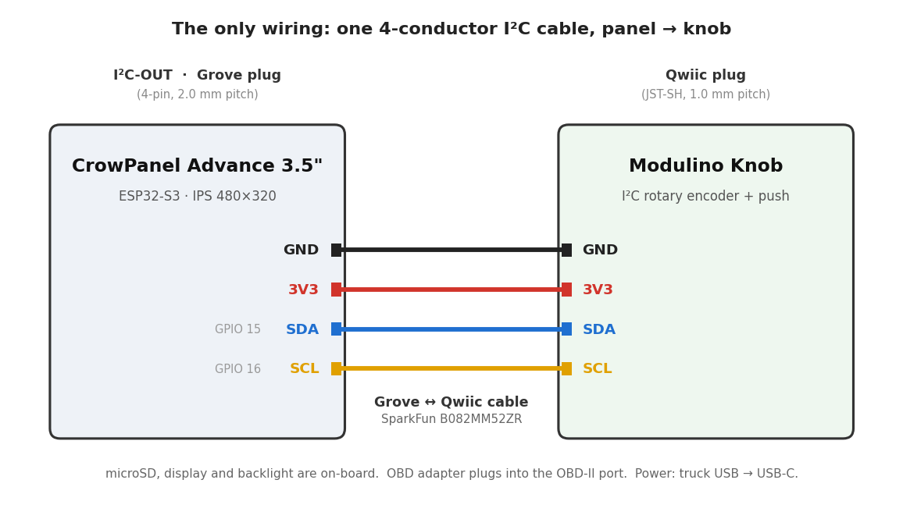

# Wiring

Almost everything is on-board or plug-in. The **only wiring you assemble is a single
I²C cable** from the display panel to the rotary knob.

## The one connection: panel → knob

| CrowPanel I²C-OUT (Grove plug) | Wire | Modulino Knob (Qwiic plug) |
| :--- | :---: | :--- |
| GND | ⚫ black | GND |
| 3.3 V | 🔴 red | 3.3 V |
| SDA — GPIO 15 | 🔵 blue | SDA |
| SCL — GPIO 16 | 🟡 yellow | SCL |

**The two ends use different connectors** — a **Grove** plug (4-pin, 2.0 mm pitch) on the
CrowPanel's I²C-OUT port, and a **Qwiic** plug (JST-SH, 1.0 mm pitch) on the knob. Bridge
them with the **SparkFun Qwiic-to-Grove cable** (`B082MM52ZR`). That specific cable is
straight-through; many generic Grove↔Qwiic cables are *crossed* and would put 3.3 V on a
data line, so use this one.

It is plug-and-play — no soldering, no resistors. The Modulino's push button and encoder
both ride the same I²C bus; no extra wires.

> **I²C bus note:** the knob shares the GPIO 15/16 bus with the on-board RTC (0x51) and the
> capacitive touch controller (0x5D). The Modulino answers at a different address (0x3A),
> so there is no conflict. This bus is not thread-safe in firmware — all I²C access runs on
> the input task.

## Everything else — no wiring

| Part | How it connects |
| :--- | :--- |
| Display + backlight | On-board SPI (SCLK 42 / MOSI 39 / DC 41 / CS 40 / RST 2 / BL 38) |
| microSD | On-board, dedicated HSPI bus (SCK 5 / MISO 4 / MOSI 6 / CS 7) |
| RTC + coin cell | On-board (PCF8563 @ 0x51 on the I²C bus above) |
| OBD adapter | Plugs into the vehicle's OBD-II port; links over Bluetooth (BLE on this board) |
| Power | Truck USB (switched 5 V) → board USB-C |

## Mounting the knob

The knob is cable-connected, so it can mount anywhere the Grove-Qwiic cable reaches — the
same face as the screen, or off to one side within reach. The 3D-printed case
([Printables](https://www.printables.com/model/1788789-odb-gauge-cluster-case)) positions
it beside the display.

## Classic-Bluetooth board (alternative)

The `elecrow` build targets an Elecrow WROVER-B board (classic ESP32) for a
classic-Bluetooth adapter. Its input hardware differs from the CrowPanel; see
[`docs/HARDWARE.md`](HARDWARE.md) for why the CrowPanel Advance is the recommended board.
